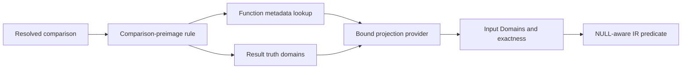

# Function preimages

Trino rewrites comparisons over selected scalar functions into predicates over the
functions' inputs. For example, `year(order_date) = 2025` becomes a range over
`order_date`, and `CAST(small_value AS bigint) < 10` becomes a comparison directly
over `small_value`. The resulting predicates expose columns and simple ranges to
predicate inference, domain extraction, and connector pushdown, and they avoid
evaluating the function for every input row.

Historically, each supported function had an expression optimizer such as
`UnwrapCastInComparison`, `UnwrapYearInComparison`, or
`UnwrapDateTruncInComparison`. Those optimizers repeat comparison normalization,
constant handling, SQL null semantics, `IN` expansion, and protection against
evaluating an operand more than once. They also identify functions by name, so the
knowledge that a function supports the transformation lives in an optimizer rather
than in the function's semantic metadata.

This design gives scalar functions and coercions an optional **domain preimage**
contract. A single expression rule uses exact results from that contract to move a
comparison from a function result to its distinguished input. `DomainTranslator`
uses the same contract and may additionally consume a conservative superset while
retaining the original expression as a residual predicate. When a consumer cannot
obtain a result with the exactness it requires, it leaves the expression unchanged.

## Scope

The design covers scalar comparisons in expression-bearing plan nodes. It supports
ordinary equality and ordering comparisons, `IDENTICAL`, `BETWEEN`, bounded
`IN` lists, and their negations when a function supplies the required metadata.
It covers explicit casts and implicit coercions because both resolve to registered
cast functions.

The design does not attempt algebraic inversion of arbitrary expressions. It does
not infer monotonicity from Java code, sample function results, or function names.
It does not cover structurally unrelated rules such as unwrapping row subscripts or
single-column rows in an `ApplyNode`.

Comparison preimages used for expression equivalence are distinct from conservative
preimages used by runtime constraint propagation. An expression rewrite must retain
the exact SQL result for every successful original evaluation, including `NULL`; a runtime constraint may use
a superset because it is only a pruning aid.

## Vocabulary

For a function `f` and a set of output values `Y`, the **preimage** of `Y` is the set
of inputs whose output belongs to `Y`:

```text
preimage(f, Y) = { x | f(x) is in Y }
```

A `Domain` represents a set of typed values through a `ValueSet` and a separate
SQL null allowance. `REAL`, `DOUBLE`, and `NUMBER` use `FloatingPointValueSet`,
which keeps ordered values and NaN membership independently. The generic factories
construct the appropriate representation, including `singleValue` for a NaN singleton.
Membership, union, intersection, and complement preserve the complete set. Providers
and consumers share this model with ordinary predicate extraction and runtime filtering;
there is no conversion to a separate preimage domain. NaN is never an ordered endpoint.
The value-set and connector contracts are described below in this document.

The preimage is a set even when `f` has no inverse function. For example, the
preimage of `{2025}` through `year(date)` is the entire interval from the beginning
to the end of 2025. It may be a point, an interval, a union of ranges, all values, or
no values.

A **result constraint** is a `Domain` of function results selected by a consumer.
For the true result of `f(x) < 10`, its non-null values are those below 10. For the
true result of `f(x) = 10`, they contain only 10. The domain's null allowance records
whether the null function result belongs to that set; it does not describe an
unknown Boolean result of the predicate.

**Truth domains** describe a predicate over a function result using two disjoint
result constraints: the values for which the predicate is true and the values for
which it is false. Values in neither domain produce unknown. An expression rewrite
needs both classifications, while a filtering consumer needs only the true domain
of the complete predicate.

The **projected argument** is the function argument exposed by the rewrite. The
consumer nominates the sole nonconstant argument of a bound call, and the provider
decides whether it supports that candidate. Other arguments are **parameters**. Parameters must be plan-time constants unless the
projection contract explicitly supports a broader form. In
`date_trunc('month', timestamp_value)`, `timestamp_value` is the projected argument
and `'month'` is a parameter.

A **domain projection** is bound semantic metadata that computes a preimage for one
resolved function or coercion signature. A **projection provider** is the
implementation registered with function metadata to produce that result. An exact
projection equals the true preimage. A conservative projection is a superset of the
true preimage and is useful only to consumers that preserve a residual check.

## Architecture

The feature separates function semantics from expression rewriting:



The function registry owns whether a function supports projection and how its
preimage is calculated. The optimizer owns comparison syntax, expression evaluation
rules, and generation of replacement IR. Types continue to own ordering, ranges,
adjacent-value operations, and native representations. Metadata resolves any
forward, reverse, or boundary functions required by a projection.

The main components are:

| Component | Responsibility |
|---|---|
| Function or coercion declaration | Associates a function implementation with a preimage provider. |
| Function registry | Validates the declaration, retains its provider by function identity, and binds it to a resolved signature. |
| Projection provider | Admits or declines the inferred candidate using bound types and constant parameters, then computes a domain or exact constant mapping. |
| Comparison-preimage rule | Recognizes supported predicates, infers the candidate input, constructs truth domains, invokes providers, and generates equivalent IR. |
| Domain-to-expression renderer | Renders points, ranges, unions, all, and none without changing SQL null behavior. |

The provider never returns planner IR. This keeps function semantics independent of
plan representation and prevents each provider from reimplementing null handling,
operand binding, or Boolean expression construction.

## Function metadata contract

`FunctionMetadata` has an optional domain-projection declaration. Annotated
functions use an annotation as registration convenience; programmatically declared
functions use the corresponding builder method. The metadata, rather than the
annotation itself, is the canonical contract.

A declaration identifies the provider implementation. It carries no argument index.
The function metadata establishes the general deterministic, fixed-arity, and null
contracts; the provider validates supported candidates, bound signatures, and
constant parameters. Annotated declarations use:

```java
@ScalarFunction("year")
@FunctionPreimage(YearDatePreimage.class)
```

`DomainProjection` is a service class, without value equality. It holds the registered provider and validates its returned types,
null membership, and exactness. The provider remains responsible for selecting the
correct matching inputs. Programmatic declarations attach `new DomainProjection(provider)` through the
function-metadata builder. Both forms register the same semantic contract.

Casts use the same registry contract but are normally declared programmatically.
`Cast` is an IR node, while its behavior comes from the coercion returned by
`Metadata.getCoercion`. The registry associates the projection with that resolved
coercion's function identity. Cast support therefore does not depend on recognizing
a Java cast implementation class or treating every cast as safe.

A provider operates on a bound signature and native constant values. Its logical
interface is:

```java
public interface DomainPreimage
{
    Optional<PreimageResult> preimage(Context context, Domain resultDomain);

    record Context(
            ConnectorSession session,
            BoundSignature signature,
            int inputArgument,
            List<Optional<NullableValue>> arguments,
            Exactness requiredExactness,
            PreimageFunctionDependencies functions) {}
}

public record PreimageResult(Domain inputDomain, Exactness exactness) {}

public enum Exactness
{
    EXACT,
    CONSERVATIVE,
}
```

The projected-argument position in the context has no value. Every required
parameter position contains a typed constant. `resultDomain` uses the function's
result type and describes the results accepted by the consumer, including null
allowance when relevant. A successful `inputDomain` uses the projected argument's
type. `Optional.empty()` means that the provider cannot establish a useful safe
preimage for this call; it never means the empty set. `Domain.none(type)` represents
a proven empty preimage.

Each provider invocation projects one set. The consumer owns its meaning as a true
or false domain and invokes the same API for either. Providers do not interpret
Boolean truth tables or receive a separate unknown-result flag.

For an `EXACT` result, among inputs for which the original function succeeds, an
input belongs to `inputDomain` if and only if its result belongs to `resultDomain`.
Inputs on which the original expression fails do not constrain the replacement's
result; making those inputs succeed is permitted. For a `CONSERVATIVE` result, every input
whose result belongs to `resultDomain` must belong to `inputDomain`, but additional
inputs may belong as well. A provider must never return a subset of the true
preimage. The call context states whether the consumer requires `EXACT` or permits
`CONSERVATIVE`, allowing a provider to avoid calculating a result its caller cannot
use.

Independently projected true and false domains may overlap on inputs where the
original function fails. The expression consumer declines such a pair before
constructing its disjoint truth-domain representation. Domain extraction can still
consume one projection because its contract is evaluated on successful inputs.

`DomainPreimage.Context` describes a call with one varying input and fixed values for its
other arguments. The signature supplies concrete SQL argument and result types,
including precisions and scales. `inputArgument` identifies the zero-based SQL
argument index being considered; its constant entry is empty. The context also
supplies the session and required exactness. Its function helpers evaluate the
original function on constant inputs, obtain casts and result ordering, and check
implicit coercions. Providers use these operations to calculate and check boundaries
with the same semantics as ordinary evaluation. A separate function identifier is
unnecessary because registration already selects the provider for the resolved
function. Type, arity, and constant-argument validation remain centralized.

### Candidate inference and provider admission

After ordinary constant folding, the consumer examines the call's SQL arguments.
Exactly one must be nonconstant; the others must be non-null constants. Calls with
multiple nonconstant arguments decline. Calls with only constants remain the
responsibility of constant folding. The candidate may be any expression, including
one containing multiple column references or nondeterministic operations; the usual
single-evaluation safeguards still apply.

The consumer records the candidate's zero-based SQL argument index in
`DomainPreimage.Context.inputArgument()`. The candidate's context entry has no constant
value, while every other entry holds a typed constant. This is per-call information,
not registered metadata or a Java parameter index. Injected sessions and dependencies
are not SQL arguments.

Each provider entry point must admit the candidate before accessing parameters or
calculating results. For example, `date_trunc('month', ts)` nominates argument 1,
which the date-truncation provider supports. `date_trunc(unit, constant_timestamp)`
nominates argument 0, which that provider declines. The provider checks the candidate
position before reading argument 0 as a constant unit. The same requirement applies
to domain projection, native constant mapping, and comparison-identity checks.
Unsupported candidates return an empty optional, or false for comparison identity;
they must not trigger evaluation or a missing-parameter exception.

A provider may admit different argument positions for different calls. Registration
does not restrict that choice, but every admitted call must satisfy the same exactness,
null, and failure contracts. Parameter annotations could express fixed argument roles
in the future; they are not required by this contract.

### Native comparison constant mapping

Array, row, and map comparisons can return unknown even when both operands are non-null,
because their elements or fields may contain nulls. Such comparisons cannot in
general be lowered to the ordinary truth-domain representation. A provider can
instead implement `comparisonConstant(context, constant)`, returning an optional
typed input constant. This promises that every supported native comparison operator between
the original call and the result constant has the same result when applied to the
projected argument and the mapped constant, on every successful original evaluation.
The replacement must also succeed on those evaluations.

The common expression rule retains the native comparison operator and substitutes
the input and mapped constant. For `IN`, every item must map; the input is still
evaluated once and the list does not expand. Negation remains outside the native
comparison. Providers return semantic values, never planner IR. This exact contract
is separate from domain extraction: a mapped comparison need not have representable
truth domains, so extraction can retain the predicate as a residual.

Structural cast providers map array elements, row fields, and map keys and values recursively, preserving
nested nulls. Each non-null scalar constant must have an exact round trip through
an eligible coercion that preserves comparison at that value. Floating-point
precision boundaries and session-dependent time-zone conversions require the same
checks as scalar casts. A lossy mapping or known conversion failure causes a decline;
rounding a composite constant is insufficient to preserve nested-null comparisons.

### Eligibility requirements

The registry accepts a comparison projection only for a deterministic scalar
function. For the bound call and accepted parameters, the provider must establish
all of the following:

1. Domain projection requires orderable argument and result types whose comparison
   truth sets can be represented by `ValueSet`. Exact constant mapping, described
   below, also supports native comparisons that return unknown for non-null values.
2. With all parameters fixed, the function returns null if and only if the
   projected argument is null. In particular, a non-null projected argument cannot
   produce null.
3. For every input on which the original expression succeeds, the replacement
   succeeds with the same result. A rewrite may eliminate a failure of the original
   expression; it must never introduce a failure into a successful query.
4. Every exact result is exact under Trino's comparison operators, including
   type-specific ordering and representation rules. Every conservative result is a
   proven superset under those same rules.
5. Projecting does not depend on mutable external state beyond values represented
   in the call context.

Ordinary non-nullable scalar arguments and a non-nullable return establish much of
the null relationship, but the registry records it explicitly because a function
may opt into called-on-null conventions. `ResolvedFunction.neverFails` is a sufficient condition for safely eliminating a
call, but is not required for projection. Cast providers may describe their
successful inputs even when other source values would overflow the original cast.
Providers must avoid making planning-time helper conversions a new source of query
failure. Parameter validation can establish stronger safety, as it does for a
constant zone in `at_timezone`.

A provider reports unsupported input with `Optional.empty()`. It does not catch an
arbitrary exception and reinterpret it as unsupported. Known value-conversion failures while calculating boundaries cause the provider to
decline the rewrite, leaving the original expression available for runtime
evaluation. This prevents a boundary calculation from failing a query whose actual
rows never evaluate that conversion. Cancellation, resource exhaustion, and internal
errors propagate.

## Rewrite lifecycle

For a supported predicate over a function call, the rule performs these steps:

1. Recursively rewrite child expressions, then normalize the comparison so the
   candidate function is on the left. Flipping sides also flips an ordering
   operator.
2. Resolve and simplify the other comparison operands, including bounds and list
   items. Continue only when they are typed constants, which may be null. Preserve
   the original expression when constant evaluation cannot be completed safely.
3. Look up domain-projection metadata by resolved function identity. Infer the
   sole nonconstant SQL argument and bind the other arguments as non-null constants.
4. Construct the result truth domains, composing supported comparisons and applying
   negation according to SQL's three-valued truth tables.
5. Ask the provider to admit the inferred candidate and obtain exact input preimages
   for both truth domains. Ask the provider for each
   required set unless a preimage can be derived from an established contract. If
   either classification cannot be established exactly, retain the original
   expression. A conservative result is unusable for expression replacement.
6. Render the input truth domains as a Boolean-or-null expression over the projected
   argument, simplifying only when all three results are preserved.
7. Bind the projected argument when the replacement would otherwise evaluate it
   more than once, without introducing evaluations that can make a successful query fail.

For example:

```text
date_trunc('month', ts) = TIMESTAMP '2025-03-01'
```

The equality's true domain is the singleton `{2025-03-01 00:00:00}`, and its false
domain contains every other non-null result value.
The `date_trunc` provider maps that singleton to
`[2025-03-01 00:00:00, 2025-04-01 00:00:00)`. The renderer emits the two comparisons
over `ts`, with one binding if `ts` is not safe to duplicate.

The same provider can reject a non-image result exactly:

```text
date_trunc('month', ts) = TIMESTAMP '2025-03-15'
```

No input maps to March 15 under month truncation, so the preimage is empty. The rule
emits a null-preserving false expression.

## SQL null and evaluation semantics

The rule owns three-valued expression behavior. A single `Domain` can identify
inputs that make a filtering condition true, but cannot distinguish false from
unknown among the other inputs. In particular, a null item in an `IN` list makes
nonmatching non-null inputs produce unknown; setting the domain's null allowance
cannot represent that behavior.

The consumer represents truth domains conceptually as:

```java
public record TruthDomains(Domain trueDomain, Domain falseDomain) {}
```

Both domains have the same type and must be disjoint. Before projection they use
the function result type; afterward they use the projected argument type. The
unknown domain is the complement of their union over all values, including null.
It need not be stored or projected separately.

Given exact input truth domains, the general rendering is:

```text
CASE
    WHEN belongs(input, trueDomain) THEN TRUE
    WHEN belongs(input, falseDomain) THEN FALSE
    ELSE NULL
END
```

`belongs` denotes two-valued set membership and honors the domain's null allowance.
A raw SQL equality or range comparison is not by itself such a membership test,
because it can return null. The renderer supplies the required null handling.
The binding and failure rules below apply to the complete expression.

The renderer simplifies this general form when it can prove equivalence. It may
also avoid a provider invocation when a preimage follows from the established
contracts. For example, for an ordinary comparison against a non-null constant
whose comparison is non-null for all non-null result values, the null-reflecting contract permits the input false domain to be the non-null input
domain minus the exact true preimage. This derivation does not apply to a
null-bearing `IN` list. No derivation may treat the complement of a true domain as
the false domain without also accounting for unknown values.

For such an ordinary comparison against a non-null constant, a null projected
argument must produce null. Conceptually, the replacement is:

```text
IF(input IS NULL, NULL, value_set_predicate(input))
```

The optimizer may use an equivalent, simpler expression when the rendered predicate
already has the required null behavior. An empty preimage becomes false-if-not-null;
an all-values preimage becomes true-if-not-null.

For `IDENTICAL` against a non-null constant, null input produces false, so the
replacement is equivalent to:

```text
input IS NOT NULL AND value_set_predicate(input)
```

For `IDENTICAL NULL`, the null-reflecting contract permits replacement with
`input IS NULL`. Ordinary comparisons against null produce null, subject to the
optimizer's established rules for retaining evaluation of expressions that may
fail.

Function implementations have no observable side effects, but input expressions
can be nondeterministic or fail. If rendering refers to the projected argument more
than once, the rule uses a `Let` binding unless the argument is a reference or
constant that is safe to duplicate. A rewrite may suppress an evaluation that would fail. The consumer uses the shared
`mayFail` analysis when deciding whether predicates can be combined. It must not
move evaluation into a branch that originally succeeded without performing it, or
duplicate a varying operand.

## Result constraints and rendering

For supported result types and a non-null constant `c`, the rule constructs these
true result domains. Each excludes the null function result:

| Comparison | Result constraint |
|---|---|
| `f(x) = c` or `f(x) IDENTICAL c` | the point `{c}` |
| `f(x) <> c` | all non-null result values except `{c}` |
| `f(x) < c` | the range below `c`, excluding `c` |
| `f(x) <= c` | the range below `c`, including `c` |
| `f(x) > c` | the range above `c`, excluding `c` |
| `f(x) >= c` | the range above `c`, including `c` |

For ordinary comparisons whose non-null operands always give a non-null result,
the false domain is the complement of the true domain within non-null result
values. For `IDENTICAL`, the false domain is the complement over all result values,
including null. An ordinary comparison against null has empty true and false
domains. `IDENTICAL NULL` has the null-only true domain and the non-null false
domain.

The conversion uses the result type's comparison semantics. If either truth set
cannot be represented exactly, domain projection declines. The expression rule
can still use an exact native comparison constant mapping when one is available. It
must not assume that non-null operands always produce a non-null comparison;
structured values with null components can violate that assumption. Exceptional
unordered-value behavior also requires explicit support in the selected `ValueSet`
implementation.

Truth domains compose according to SQL's truth tables. For predicates `A` and `B`
over the same function result, write their domains as `(T_A, F_A)` and `(T_B, F_B)`:

| Predicate | True domain | False domain |
|---|---|---|
| `NOT A` | `F_A` | `T_A` |
| `A AND B` | `T_A` intersect `T_B` | `F_A` union `F_B` |
| `A OR B` | `T_A` union `T_B` | `F_A` intersect `F_B` |

These rules lower the supported predicate forms over one call with constant bounds
or list items. They do not authorize combining arbitrary expressions or changing
their evaluation behavior.

The renderer prefers a single comparison for one-sided ranges, equality for points,
and `BETWEEN` for closed intervals when that retains exact endpoints. It uses
conjunctions, disjunctions, or `IN` for other bounded unions. Expansion has a
planner-wide size limit covering both truth domains and the complete rendered
expression. If exact construction or rendering would exceed it, the rule leaves
the original expression unchanged.

`BETWEEN` composes its two comparisons using the `AND` rule before projection:
intersect their true domains and union their false domains. A null bound therefore
does not imply an always-unknown result. For `y BETWEEN NULL AND 6`, the true domain
is empty and the false domain contains non-null values above 6; the other values
produce unknown. `NOT BETWEEN` swaps the resulting domains.

An `IN` list composes its equalities using the `OR` rule: union their true domains
and intersect their false domains. Every item must be a constant. An equality
against a null item contributes empty true and false domains, making the whole
list's false domain empty. For scalar comparisons with no additional unknown cases:

| Predicate over result `y` | True domain | False domain |
|---|---|---|
| `y IN (1, 2)` | `{1, 2}` | Non-null values except `1` and `2` |
| `y IN (1, 2, NULL)` | `{1, 2}` | Empty |
| `y NOT IN (1, 2, NULL)` | Empty | `{1, 2}` |
| `y IN (NULL)` | Empty | Empty |

For a null-bearing `IN`, the renderer can emit `CASE WHEN belongs(input,
truePreimage) THEN TRUE ELSE NULL END`. A nonmatch must not become false. A
null-only list produces unknown for every input, subject to preserving required
operand evaluation. The rule retains a bounded expansion limit equivalent to the
ten-item expansion limit, and every required preimage must be exact. A point-to-point
projection that keeps an `IN` list at its original size is not subject to the
expansion limit. Its projected points must be expressible by SQL equality: a NaN
singleton declines this shortcut because `IN` cannot match NaN. Domain extraction
can also combine independently extracted comparisons without expanding the output
expression.

The engine permits projection metadata on functions that can fail. Providers
validate parameter-dependent semantics before projecting even an empty or universal
set. Eliminating a failure is permitted; producing an incorrect result or a new
failure on an input that originally succeeded is not.
The context exposes engine-resolved invocation and coercion helpers under the active
session, including character-coercion policy. Providers invoke these only on known
constant values, including runtime domain boundaries. It also supplies a native
comparator for non-null function results, with unordered values sorted last. The engine resolves this comparator
lazily and reuses it for the bound call. Cast providers use it throughout boundary
conversion and binary search, without constructing ranges for scalar comparisons.

## Reusable projection families

Providers share semantic helpers for the recurring projection families below.

### Comparison identity

Providers expose `isComparisonIdentity(context)` for validated calls whose input
and result have the same comparison type and semantics. The consumer can remove
such calls from either side of a comparison even when the other side varies.
`at_timezone` uses this contract after validating a non-null constant zone; invalid
or varying zones retain the original call.

A comparison-identity projection maps every result constraint to the same input
constraint. It applies when a function changes representation that comparisons do
not observe. `at_timezone(timestamp_with_time_zone, zone)` belongs to this family:
timestamp-with-time-zone comparisons use the instant, and changing the display zone
does not change the instant.

The zone must be a non-null constant and must be validated before projection. An
invalid or dynamic zone causes the rule to retain the original call because removing
it could suppress an error or change null behavior. The time-with-time-zone overload
does not acquire this projection merely because it has the same function name.

### Order embedding

An order embedding is injective and strictly order-preserving over the source
domain. Widening integral casts are the simplest example. The common projector uses
the forward conversion, a reverse conversion at the comparison constant, a forward
round trip, and source type bounds.

Given `CAST(x AS T) θ t`, it converts `t` to the source type as `s`, then converts
`s` forward as `t'`. Comparing `t` and `t'` reveals whether the reverse conversion
landed exactly, below, or above the original constant. This determines both the
source boundary and whether it is inclusive. Source minimum and maximum values
identify result constraints entirely outside the cast's image.

The family is parameterized by an eligibility predicate because order embedding can
depend on bound types, session policy, and the comparison value. Declaring a cast as
an implicit coercion is not proof that it is injective: legacy numeric coercions such
as sufficiently wide integer to approximate numeric types can lose distinctions.

### Ordered bucket

An ordered-bucket projection maps a contiguous interval of source values to one
ordered result value. Its provider supplies the exact lower and upper boundary of a
bucket and determines whether a proposed output belongs to the function's image.

`year(date_or_timestamp)` and `date_trunc(unit, value)` use this family. `year`
converts a result year to the first instant of that year and the first instant of the
next year. `date_trunc` computes the canonical bucket value and its successor from
the constant unit. Equality maps to one bucket; inequalities map to the appropriate
open or closed half-line depending on whether the comparison constant is itself a
bucket value.

Boundary helpers use half-open ranges where practical. This avoids manufacturing a
last representable picosecond and composes naturally across timestamp precisions.
When only an inclusive endpoint can be rendered, the type's adjacent-value
operations convert the boundary without assuming a fixed precision.

## Cast projections

Cast registrations select providers for the computations shared by their type
pairs. The optimizer uses the same preimage contract for all of them:

- `IntegralCastPreimage` clips lossless integral widening directly to the source range.
- `OrderPreservingCastPreimage` uses forward/reverse round trips for casts with
  unique boundaries, including supported decimal and timestamp precision changes.
- `IntegralToFloatingPointCastPreimage` uses those round trips in injective regions
  and searches the source integers when several inputs round to the same result.
- `CharToVarcharPreimage` and `VarcharToCharPreimage` own their distinct character
  equality semantics. The former uses `CharacterPreimages` for legacy space-padding.
- `TimeCastPreimage` supplies the final representable time as the source maximum
  before applying the shared round-trip computation.
- `TimestampDatePreimage` computes day buckets directly.
- `TimestampWithTimeZoneCastPreimage` owns session-zone normalization, transition
  admission, and the neighboring-date checks for DATE casts.
- `StructuralCastPreimage` recursively maps native constants for arrays, rows, and maps.

`CastPreimages` contains the common mechanics: ordered-range and equality-set
accumulation, round-trip boundary conversion, and recognition of ordinary conversion
failures. It also shares scalar admission checks with structural constant mapping.
Type-pair computations remain in their registered providers; adding a new computation
does not require adding a dispatch branch to a universal cast provider.

| Cast family | Projection behavior |
|---|---|
| Lossless widening exact numeric cast | Common order-embedding projector. |
| Eligible exact-to-approximate cast | Direct boundary conversion in exact regions; monotone source-integer search accounts for every value in a rounded floating-point result. |
| Decimal cast | Scale increases preserve successful inputs; boundaries account for rounding of reverse conversions and source-range limits. |
| Timestamp to date | Ordered day buckets. |
| Timestamp precision widening | Order embedding. |
| Timestamp to timestamp with time zone | Value- and session-zone-dependent order embedding; decline during local-time overlaps or other non-injective regions. |
| Char to varchar | Exact equality-family projection when the cast does not narrow. Legacy space-padding uses ordered character boundaries; the standard unpadded policy may use conservative ordering extraction with a residual. |
| Varchar to char | Dedicated projection accounting for trimming, length checks, and char comparison semantics; decline when an exact preimage is not representable. |
| Array, row, and map casts | Exact recursive constant mapping preserves native comparisons and nested nulls; unsupported or lossy element mappings decline. |
| Unsupported cast or unrepresentable preimage | No projection. A cast may fail on other inputs provided the rewrite preserves all successful results and introduces no failure. |

Providers that use boundary round trips resolve both forward and reverse coercions
through metadata. They do not assume that the reverse is implicit or globally safe:
they invoke it only on known boundary values and check the forward round trip. A failed
reverse conversion can still yield an exact all-or-none result when source bounds
prove the answer; otherwise the provider declines.

Character casts remain policy-sensitive. A mapping that preserves Java/native
values can still fail to preserve SQL comparison order because char padding or
trimming changes equality. The provider uses the active `CharVarcharCoercion` policy
and the actual source and target lengths. It never derives eligibility from the cast
operator name alone.

Timestamp-with-time-zone eligibility uses `java.time.zone.ZoneRules` to identify gaps
and overlaps. Regional-zone boundaries before 1970 decline projection because
historical rules can differ from those used by the legacy casts. Fixed-offset zones
have no historical restriction. Both occurrences of a repeated local time map back
to the same source timestamp, but the ordinary cast selects only one occurrence.
Reversing a boundary
in the other occurrence can therefore exclude inputs that satisfy the original
comparison. The provider declines boundaries in either occurrence of the repeated
local time; runtime domain consumers then perform no pruning. It also declines
boundaries where a spring clock change makes the cast non-monotonic. This
value-dependent decision is why a Boolean `injective` annotation on a cast is
insufficient.

The DATE cast samples the session-zone offset at the date's UTC midnight, rather
than resolving a local midnight. Around an offset change, its result can belong to
the preceding local date. A reverse cast alone therefore does not establish the
correct boundary. The provider evaluates the adjacent representable dates through
the ordinary forward cast and requires their results to strictly bracket the
requested boundary. It declines if a neighbor reaches or crosses that boundary,
including when a skipped day maps two dates to the same result. These checks
supplement timezone transition admission and respect DATE's native bounds.

## Rule ownership and optimizer integration

The comparison-preimage rule is an `ExpressionRewriteRuleSet` registered wherever
the existing comparison unwrappers operate. It runs after expression canonicalization
has normalized comparisons and after enough constant folding is available to expose
parameters and comparison constants. Its output remains ordinary IR, allowing
subsequent Boolean simplification, domain translation, predicate inference, and
connector pushdown to work without understanding projection metadata.

Comparison unwrapping has one owner. Function-name-specific
rules for `year`, `date_trunc`, and `at_timezone`, and comparison machinery in
`UnwrapCastInComparison`, do not remain independently active because overlapping
rules could disagree about failure, null, or expansion behavior.
`PredicatePushDown.visitProject` invokes the same rule after inlining deterministic
project assignments and canonicalizing the resulting predicates. This handles
function calls and casts newly exposed by inlining without a second implementation.
Structural rules
such as `UnwrapRowSubscript` retain their separate ownership.

Nested eligible calls can be projected repeatedly through normal optimizer fixed
point processing. Each step must independently return an exact preimage. The rule
does not compose providers into an opaque cached transformation, so session and
constant validation occurs against the actual resolved call at each layer.

Metadata lookup uses resolved function identity, never a display or canonical name.
This prevents an unrelated catalog function named `year` from acquiring built-in
semantics and lets overloads of one name make different eligibility decisions.
SQL language functions have identities owned by `LanguageFunctionManager`, including
inline functions that share the global system catalog handle. They are not looked up
in the global function registry for preimage metadata. SQL language functions and
functions from unsupported catalogs decline projection without failing planning.

## Function-registration validation

Registration rejects malformed declarations before queries can use them:

- the signature must have a nonempty, fixed argument list;
- a projection may be attached only to a deterministic scalar function or cast;
- provider-declared result and input types must agree with each bound signature;
- required helper dependencies must resolve without introducing dependency cycles;
- annotation and programmatic metadata for one function identity cannot conflict;
- projection metadata must state its null and failure contract explicitly.

Providers are trusted semantic implementations, like cast and comparison operators.
The engine cannot prove their mathematical assertions from bytecode. Built-in
providers therefore require direct semantic tests. `DomainPreimage` is a public SPI:
an incorrect provider can produce wrong query results. Provider authors must honor
its exactness, null, and failure contracts, and a catalog cannot replace the metadata
of a different function identity.

## Relationship with domain translation

Comparison projection and `DomainTranslator` operate on the same mathematical sets
but have different contracts and positions in planning.

`DomainTranslator.getExtractionResult` consumes a Boolean expression in a filtering
context. It returns a `TupleDomain<Symbol>` together with a `remainingExpression`.
The tuple domain identifies values that may satisfy the predicate. When extraction
is exact, the remaining expression is true. When only a conservative domain is
available, the domain may include extra values and the original predicate remains
as a post-filter. This is safe because domain extraction is allowed to weaken a
predicate as long as it retains the residual expression.

The comparison-preimage rule instead rewrites an expression used in any supported
plan context. Its replacement must have the same Boolean or null result as the
original expression. It has no residual-expression channel in which to preserve an
unmodeled condition. It therefore accepts only exact preimages.

| Concern | Comparison-preimage rule | `DomainTranslator` |
|---|---|---|
| Input | Supported predicate over an eligible resolved function or cast | Arbitrary filtering predicate |
| Output | Equivalent IR expression | Necessary `TupleDomain<Symbol>` plus residual IR |
| Exactness | Exact only | Exact or conservative with residual |
| Operand | Any expression that can be safely bound | Ultimately a symbol/reference for a useful domain |
| SQL null result | Preserved as expression semantics | Only true admits a row; domain null allowance identifies accepted null inputs |
| Main consumers | Expression simplification, predicate inference, joins, projections, and later domain extraction | Scan constraints, predicate pushdown, and other domain consumers |

The normal flow is:

```text
comparison over function
        |
        v
exact comparison-preimage rewrite
        |
        v
simple comparison or range over input
        |
        v
DomainTranslator extraction when the input is a symbol
```

For example, the preimage rule rewrites `year(order_date) = 2025` to a range
expression over `order_date`. If `order_date` is a symbol in a filter,
`DomainTranslator` then extracts that range into its `TupleDomain`. If the expression
appears in a projection, join condition, or another non-filtering context, the exact
rewrite is still useful even though no tuple domain is extracted there.

`DomainTranslator` uses providers as the authority for exact cast extraction. It
also has conservative varchar-to-date and character-cast extraction paths that
retain the original predicate as a residual. These weaker constraints do not claim
an equivalent expression. There is no independent exact cast-unwrapping fallback
based on implicit coercibility or saturated-floor conversion.

`DomainTranslator` also retains an `at_timezone` filtering path for calls whose zone
argument varies by row and for the interval-offset overload, which has no preimage
provider. The preimage contract currently requires constant parameters, so it cannot
express the varying-zone case. Instant comparisons can still constrain the timestamp
column conservatively while retaining the original predicate to enforce the zone's
null and invalid-value behavior. The varchar-zone overload with a valid constant zone
uses the exact provider path. Comparisons requiring null or complemented semantics
that the filtering path cannot represent retain their original expression.

Generalized extraction follows the same sequence for functions and casts:

1. Normalize the supported predicate over a call and constants.
2. Use the shared truth-domain construction to identify the result `Domain` whose
   members make the complete predicate true, including any negation. Extraction
   need not construct or project truth domains that are unnecessary for this set.
3. Resolve domain-projection metadata by function identity and request a preimage
   with conservative results permitted.
4. Continue through another eligible nested call, or publish the input domain once
   the projected argument is a reference.
5. Return `TRUE` as `remainingExpression` only when every projection in the chain is
   exact. If any projection is conservative, retain the original predicate as
   `remainingExpression` even if later projections are exact.

Negation swaps the result truth domains before projection. The true domain of
`NOT A` is the false domain of `A`, not the complement of its true domain: the latter
would also include unknown results. For example, `y NOT IN (1, NULL)` has an empty
true domain even though `y IN (1, NULL)` has the singleton true domain `{1}`. The
ordinary failure-preservation rules still apply when extraction proves no value
can satisfy a predicate.

Separately, `DomainTranslator` never complements a conservative input preimage:
the complement of a superset is a subset and could discard matching rows. A
provider may calculate a conservative preimage for the true result domain of the
complete negated predicate if it can prove that preimage is still a superset.

Conservative extraction remains owned by `DomainTranslator`. A provider API shared
with conservative consumers must label its result contract explicitly. An `EXACT`
result can be used for expression rewriting and can eliminate the residual predicate.
A `CONSERVATIVE` result can only narrow the tuple domain while retaining the residual
expression. An exact caller never accepts a conservative result.

`ValueSetToExpression` renders `ValueSet` ranges as comparisons over an expression
operand. `DomainTranslator.toPredicate` and the comparison rule share this renderer
and wrap its output according to their respective null and evaluation contracts.
The comparison rule additionally preserves three-valued results and binds general
expressions. Neither consumer delegates its complete operation to the other.

## Runtime domains and cast preimages

A dynamic filter collected in a join comparison type must be translated back to the
probe column's type. If the probe applies a cast `A -> B` and the collected filter is
a domain `D` over `B`, the filter over `A` is the preimage of `D` through that cast.
The join still checks actual matches, so a conservative superset is sufficient.
A declined projection uses the all-values domain and performs no pruning.

`FunctionPreimages` binds providers from resolved function identities, typed constant
parameters, the nominated argument, and the session. It needs metadata, a function
manager, and a type manager, but no planner IR. The comparison rule uses this same
binding layer. Unary cast consumers nominate argument 0 directly. Provider presence
establishes that projection can be attempted; it does not promise support for every
runtime domain. The provider retains admission responsibility on every invocation.

Both local dynamic-filter collection and distributed dynamic-filter service apply
comparison semantics to the collected domain first, then request a conservative
cast preimage. This preserves equality, inequality, and null-safe comparison rules.
Dynamic-filter plan validation retains its implicit-coercion restriction and checks
for a registered preimage instead of requiring a reverse saturated-floor operator.
An unsupported runtime domain can weaken pruning without changing join results.

The `SATURATED_FLOOR_CAST` operator, registration, and SPI enum member are removed.
Code that referenced the old operator must use function preimages; the SPI
compatibility configuration records that specific retirement. Cast providers
own boundary conversion, forward round trips, inclusivity, and source-range clipping.
A saturated scalar boundary cannot describe an empty preimage or all values mapping
to the same rounded result; the domain contract can express both directly.
Integer-to-floating casts use monotone boundary search where adjacent integers share
a floating-point result. Search takes at most the source bit width in bisection
steps, plus endpoint checks, for each bound. Exact regions retain direct conversion.
Legacy padded character boundaries retain their Unicode-aware predecessor calculation,
including surrogate gaps and supplementary code points, inside a provider helper.
The ordinary varchar boundary path uses reverse truncation and a forward round trip.
Providers preserve successful evaluations even when another source value overflows
the original cast, including decimal scale increases that reduce integer capacity.

Runtime domain projection does not render an expression and does not inherit the
comparison rule's list-expansion or 32-range budget. Collected domains remain subject
to dynamic filtering's existing size limits. Providers collect projected ranges and
construct the normalized value set once, sorting and coalescing the ranges together.
This keeps range collection proportional to the number of projected ranges instead
of repeatedly copying the accumulated value set. NaN combinations remain exact in
`Domain`. Connector boundaries adapt constraints that existing range consumers cannot
accept to safe supersets. The join remains authoritative when runtime pruning loses
precision.

## Correctness validation

Every projection family is tested by comparing the original and projected
expressions over representative values. Tests cover the source minimum and maximum,
values immediately around projected boundaries, constants inside and outside the
function image, and null on every relevant operand.

Order-embedding tests include constants whose reverse conversion rounds down,
rounds up, fails, or lands at a source endpoint. Bucket tests cover the first and
last representable bucket, constants that are not canonical bucket values, and every
supported timestamp precision. Time-zone tests include gaps, overlaps, zone changes,
and invalid and null zones. Character tests cover empty values, trailing spaces,
length boundaries, non-space truncation, and every supported char/varchar coercion
policy.

Expression-level tests also verify comparison reversal, every comparison operator,
`IDENTICAL`, `BETWEEN`, `IN`, their negations, expansion limits, nested eligible calls,
and one-time evaluation of nondeterministic or potentially failing operands. The
equivalence oracle uses `original IS DISTINCT FROM rewritten`; it must be false for
every generated input.

Truth-table cases cover matching and nonmatching values and null inputs for
null-bearing and null-only `IN` and `NOT IN` lists. `BETWEEN` and `NOT BETWEEN`
cases cover either or both bounds being null, including a false comparison paired
with an unknown comparison. Projection contexts check true, false, and unknown
separately; filtering checks alone cannot distinguish false from unknown. These
cases also exercise composition under supported negations and verify that a
rewritten expression introduces no failures on inputs for which the original succeeds.

Domain-extraction tests verify that negation selects the false result domain,
conservative projection retains the original residual, and a later exact projection
does not erase conservatism from an earlier step in a nested call. Truth-domain and
renderer tests cover type agreement and disjointness, domain null
allowance, and the combined expansion limit.

Candidate-admission tests cover supported and unsupported positions, providers that
accept either argument, constant folding, multiple varying arguments, and preserved
single evaluation of a nontrivial candidate.

Tests for metadata registration verify that aliases use the metadata of their
resolved function identity and that unrelated same-name catalog functions do not
inherit a projection. Tests for unsupported signatures verify that the original IR
is retained.

## Value sets and connector enforcement

A `Domain` describes the possible values of one variable. It contains a `ValueSet`
of non-null values and a separate null allowance. `TupleDomain` combines per-column
domains as a conjunction. Combining domains for each column independently can lose
correlations between columns, so a column-wise union can be a superset even though
each individual column's value-set operations preserve exact membership.

Use the `ValueSet` factories to construct sets appropriate to a type. Orderable
types normally use sorted ranges, comparable types without ordering use discrete
sets, and other types support all-or-none sets. `REAL`, `DOUBLE`, and `NUMBER` use
`FloatingPointValueSet`, which stores ordered values and independent NaN membership.
Constructing a `Domain` from an older floating-point `SortedRangeSet` normalizes it
to this representation without changing its membership.

Legacy range sets and floating-point value sets interoperate through `ValueSet`
set operations in either operand order. Mixed operations preserve NaN membership,
including when subtracting a legacy range set from a floating-point set.
`SortedRangeSet.intersect(ValueSet)`, `union(ValueSet)`, and `union(Collection<ValueSet>)`
return `ValueSet`, since a mixed result may require the floating-point representation.
The overloads taking a `SortedRangeSet` retain their concrete range result. Code
using the changed concrete SPI signatures must be recompiled for this Trino version.

### NaN and set operations

NaN is a non-null value. It is not an ordered range endpoint, but it can belong to a
set independently of the ordered values. A NaN singleton, a finite interval plus
NaN, and all ordered values excluding NaN are distinct representable sets.
`containsValue`, union, intersection, subtraction, and complement account for NaN.
Joining ranges that cover all ordered values does not implicitly add NaN.

Set membership is distinct from SQL comparison. SQL equality with NaN is false,
while `IS NOT DISTINCT FROM` can match it. A consumer rendering a domain must
express NaN membership explicitly rather than treating it as an equality or `IN`
value. Null allowance also remains separate from the unknown Boolean result of a
SQL comparison.

### Consuming a value set

The four-callback `ValuesProcessor` methods visit ranges, discrete values,
all-or-none sets, or a complete `FloatingPointValueSet`. Its `getOrderedValues()`
returns only the ordered members, with explicit inclusive infinity bounds; the
consumer must also handle `isNaNAllowed()`. Ordered comparisons that need an
extreme value use these bounds, since a compatibility range view may make an outer
endpoint unbounded. Infinity singletons remain bounded in either view.

The older range interface can represent ordered subsets excluding NaN, and the
all-values set including NaN. `FloatingPointValueSet.asRanges()` returns an exact
range representation only in those cases. `getRanges()` and the three-callback
processor reject other NaN-containing sets rather than silently omitting members.
The immutable compatibility representation is computed once and reused for range
reads. Connector support checks use membership flags without rebuilding ranges;
retained-size accounting includes a separate compatibility representation when needed.

Boolean containment and overlap checks compare NaN membership separately and use
the ordered-range predicates directly, preserving their early termination.

Domain simplification preserves NaN membership while widening ordered ranges.
Serialization records the floating-point representation explicitly. Existing
serialized range sets remain readable; their all-values form includes NaN and
their proper subsets exclude it.

### Connector boundary

Connectors receive the complete domain, including independent NaN membership. A
constraint summary may be a conservative approximation of the query predicate;
its membership is nevertheless well defined. The engine retains the query
conditions omitted from that summary.

A connector may enforce the supplied domain, enforce a safe superset and return
the required `remainingFilter`, or decline pushdown. If it widens a domain, it must
not claim to enforce the original restriction. Approximation belongs to the
connector and its column mapping, including after domain compaction. SQL rendering
must implement the chosen predicate without introducing further unreported widening.

The generic JDBC renderer does not support NaN predicates or infinity parameters.
Its pushdown controller retains unsupported restrictions as residuals. A connector
with native support can supply its own column-mapping controller and renderer.
Finite-only column mappings can enforce ordinary ranges without a NaN residual.
Mappings with infinity support can use bounded ordered ranges to exclude NaN even
when the remote database orders it above or below numbers. For example, the JDBC
`FloatingPointQueryBuilder` renders explicit infinity bounds and pairs with
`FLOATING_POINT_PUSHDOWN`; Oracle selects this representation only for its binary
floating-point types. NaN-containing domains still require a residual when the
renderer has no native NaN predicate.
Generic unbounded ordered comparisons also retain a residual because a backend may order
NaN above or below numbers. Dynamic filters are approximated before intersection
with constraints the connector has already agreed to enforce.
An ordered universe bounded by infinities can be rendered as `IS NOT NULL` when
that column cannot contain NaN, or by a native NaN exclusion when supported; the
engine representation does not require binding those endpoints as SQL parameters.

Split enumeration and page sources can use conservative approximations of dynamic
filters, or ignore unsupported restrictions. The join remains authoritative.
Index lookup restrictions require the same exact lookup semantics as before;
unsupported restrictions must not be silently dropped.

File statistics are conservative domains of values that may occur in a section.
Finite floating-point min/max bounds do not establish that NaN is absent. Where
statistics cannot rule it out, their domain also allows NaN. Dictionary and Bloom
filter pruning must likewise avoid false negatives for NaN-containing predicates.

This SPI change requires consumers to handle or safely decline the new domains;
recompilation alone is insufficient. There is no universal connector capability
switch or engine-wide conversion to legacy ranges.

Native floating-point predicates must preserve Trino's signed-zero equivalence.
Iceberg equality sets include both signs of zero; inclusive bounds admit both
signs and exclusive bounds exclude both. Bloom filters are skipped for a column
whose domain allows NaN, before expanding discrete values or loading its filter.
Other columns remain eligible for pruning.

JDBC applies the column mapping's pushdown policy to a dynamic filter on the scan
connection before intersecting it with table constraints that were already accepted
as enforced. It can reuse mappings for selected columns and resolve additional filter
columns on that same connection. SQL construction renders the selected constraint
without widening an already-enforced predicate or repeating pushdown policy.

Finite `NUMBER` values remain eligible for generic JDBC predicates. The type can
also represent NaN and infinities, so checking finiteness uses the value's kind, not
the presence of the `NUMBER` type. The standard writer binds finite values as JDBC
`BigDecimal`; nonfinite values and unordered comparisons still require the column
mapping's backend-specific support or a residual.

## Compatibility and observability

The rewrite has no user-visible configuration because it is an exact semantic
optimization. Unsupported or uncertain cases retain their original expression.
Existing session properties that change function or coercion semantics are inputs to
projection eligibility; selecting a legacy char/varchar policy, for example, selects
the matching preimage behavior rather than bypassing the policy.

The rule participates in existing optimizer rule statistics. A provider decline is
normal and does not produce a warning. Debug-level diagnostics may distinguish no
metadata, nonconstant parameters, unsupported bound signature, unrepresentable
preimage, and expansion limit, but messages must not include large constant values or
create per-row output.

Connector predicate pushdown consumes ordinary expressions and domains. A connector
remains responsible for ensuring that its remote comparison semantics match the
engine or for retaining the engine predicate as a post-filter. Comparison projection
does not make a remotely different collation, padding rule, or timestamp
interpretation safe.

Runtime constraint propagation shares the semantic provider API with expression
rewriting. The requested contract is explicit as `EXACT` or `CONSERVATIVE`; an exact
caller rejects a conservative result. Runtime consumers do not invoke planner IR
rewriting to convert domains.

## Limitations and possible extensions

The initial contract requires one projected argument and constant parameters. A
function such as addition with two varying operands needs a relational constraint,
not a one-dimensional `ValueSet`, and remains unsupported.

Domain-based rewrites require preimages representable and renderable as bounded-size
`ValueSet` expressions. Exact native constant mappings support additional composite
comparisons without representing their truth domains. A function whose exact preimage contains many disconnected regions
may be mathematically projectable but still be rejected to protect planning time and
plan size.

`REAL`, `DOUBLE`, and `NUMBER` projection use explicit NaN membership in the shared
`Domain` model. Ordinary comparisons with a NaN constant are false except for
inequality; `IDENTICAL` matches NaN. Negation complements both ordered values and NaN
membership, while null continues to follow SQL three-valued logic. `DomainTranslator`
extracts these sets exactly and the shared renderer expresses NaN membership with
`IDENTICAL`. Connectors receive the complete domain and select compatible supersets when
necessary. Static pushdown retains the original domain as a residual wherever the
connector approximation loses precision.

The provider API exposes semantic code, not a proof language. A future declarative
layer could describe common boundary functions, inverses, and round trips and compile
them into the built-in projection families. Such a layer would reduce small provider
classes but would not remove the need to specify cast eligibility, bucket boundaries,
null reflection, and failure behavior.

The same mathematical mechanism could also support connector expression
translation, statistics derivation, or additional runtime constraints. Those consumers have
different exactness and representation requirements, so sharing is limited to
metadata and pure semantic helpers until their contracts are explicitly aligned.
