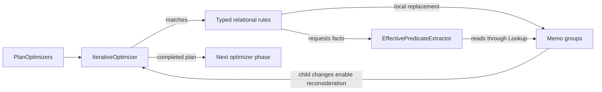

# Relational predicate pushdown

Relational predicate pushdown moves filters closer to the rows they constrain
and derives restrictions from relationships such as join equalities. Filtering
an input before a join or aggregation can reduce the work performed by later
operators. A restriction that reaches a table scan can also become a connector
constraint, allowing the connector to avoid reading unnecessary data.

A whole-plan predicate visitor and a separate iterative cleanup pass see
different intermediate plans. Cleanup can expose an opportunity that the visitor
has already passed, and connector pushdown can consume a predicate that later
inference derives again. Scheduling more complete traversals does not express
when these operations have reached a common fixed point.

The design expresses relational pushdown as local rules in the iterative
optimizer. Each rule rewrites a filter over one operator, or propagates facts
through a join without requiring a parent filter. Compatible expression cleanup
and connector rules run in the same iteration. Explicit phase boundaries remain
where another optimizer requires a completed earlier transformation.

The benefit is that a child rewrite can immediately enable reconsideration of its
parent within the same phase. This is an opportunity-discovery mechanism, not a
guarantee that every predicate reaches a scan or that planning becomes cheaper
for every query.

## Concepts and responsibilities

| Concept | Meaning |
| --- | --- |
| Inherited predicate | A condition applied above an operator whose conjuncts may be movable into its inputs. |
| Effective predicate | A necessary condition derived from an operator's output. It supplies facts for inference; extraction can be conservative. |
| Symbol scope | The planner symbols available at an input or output. A predicate must be expressible in the target scope before it can move there. |
| Residual predicate | A condition retained at its original boundary because the lower input does not fully enforce it. |
| Memo group | The iterative optimizer's identity for a subplan. A `GroupReference` points to a group whose current contents can change after a rewrite. |
| Enforced scan constraint | A constraint already guaranteed by a table scan, recorded on `TableScanNode`. It is distinct from the predicate reported by connector table properties. |
| Fixed point | A phase in which its applicable rules and child rewrites make no further changes. Recreating the same inferred filter does not constitute useful progress. |

`PlanOptimizers` owns phase construction and ordering. It constructs reusable rule
sets for three settings: without connector table properties, with table
properties, and with planner-managed dynamic-filter creation enabled. The first
setting omits connector table predicates; the latter two allow their use subject
to the session setting.

Each concrete relational rule is a separate class. `FilterPushdownRule` shares
typed source capture and the check for an unchanged filter/source pair. The
package-private `Pushdown` helper supplies common predicate analysis, filter
construction, and the join transformations used by both filtered and unfiltered
join rules. Each rewrite's structural precondition belongs to its rule pattern.
For example, `MergeFilters` captures a filter directly beneath another filter;
filter construction does not search memo alternatives for a filter to merge.
Rules retain configuration and matching patterns. Each application creates its
own helper using the current session and allocators.

`PredicateEnforcement` performs read-only implication analysis when an effective
predicate cannot establish that an inferred restriction is already enforced.
This analysis may follow several input mappings, so it uses a plan visitor and
reads current memo alternatives through `Lookup`. It does not match rewrites,
construct plan nodes, or retain an earlier memo's predicates.

`EffectivePredicateExtractor` reads facts from the current plan. `EqualityInference`
derives equivalent expressions within a requested symbol scope, and
`DomainTranslator` relates expressions to typed value constraints. The iterative
optimizer owns traversal, group replacement, and reconsideration of parents.
Predicate analysis can inspect descendants, but the relational rule performs one
local replacement rather than recursively rewriting the whole subtree.

## Rewrite lifecycle

Consider an inner join on `l.k = r.k` with a filter `l.k > 10` above it. The join
equality permits the additional restriction `r.k > 10`; both inputs can be
filtered before the join while the join still checks matching rows.

1. The optimizer creates a memo for the phase. Typed matching resolves a filter's
   immediate source through the current group contents.
2. The join rule combines the inherited predicate, join conditions, and effective
   input predicates. It separates conditions that can be expressed on either
   input from conditions that must remain at or above the join.
3. The rule builds input filters only where the conditions are not already
   guaranteed. It retains the necessary join criteria and residual predicates.
4. The optimizer replaces the matched group and explores its children. Expression
   simplification, projection pushdown, or connector rules may transform or
   consume the new filters.
5. A changed child makes the parent eligible for reconsideration. Inference reads
   the current input facts and checks whether its proposed predicates are already
   enforced, including when no matching filter expression remains in the tree.
6. When the phase reaches a fixed point, the optimizer extracts the plan for the
   next phase. A later phase can revisit relational pushdown after a structural
   change such as join reordering.

The same lifecycle applies when a join has no filter above it.
`PushJoinPredicates` and `PushSpatialJoinPredicates` can propagate effective input
predicates on their own. For example, a constraint already enforced by one scan
can restrict the opposite input through a join equality.

## Conditions for moving predicates

Moving a predicate must preserve output rows, duplicates, NULL behavior, and the
applicable expression-evaluation policy. Symbol availability alone is
insufficient: an operator may synthesize rows, change the number of evaluations,
or introduce values that do not exist on its input.

| Operator boundary | Supported movement and restrictions |
| --- | --- |
| Projection | Substitute assignments for output symbols. Referenced assignments must be deterministic. Repeated references may duplicate constants or symbol references; the inlining check prevents duplication of a nontrivial assignment within a conjunct. |
| Window and partitioned ranking | Push deterministic conditions on partition symbols. Conditions on computed window/ranking outputs remain above these operators. |
| Aggregation | Infer conditions expressible on grouping keys. Nondeterministic predicates and conditions requiring aggregate outputs remain above. An aggregation with any empty grouping set is a barrier. |
| Grouping-set expansion | Map predicates on grouping columns common to every grouping set into the input. Conditions on other grouping outputs or the generated group identifier remain above. |
| Union and exchange | Translate output symbols separately for each input and apply the corresponding input predicate. |
| Unnest | Push deterministic conditions on replicated symbols for INNER or LEFT unnest. Conditions on unnested values remain above; RIGHT and FULL unnest are barriers for this rule. |
| Mark-distinct | Push conditions on the distinct keys. Conditions on other symbols remain above the marker-producing operator. |
| Sort, sample, and unique-ID assignment | Forward supported input predicates. The unique-ID rule requires that the predicate not reference its generated ID. |
| Table scan | Remove conditions already guaranteed by the scan. Connector constraint application remains a separate optimizer responsibility. |

Global aggregation illustrates why an empty grouping set is a barrier. It can
produce one output row even when its input is empty. Moving a filter from that
output to the input can preserve the aggregate row that the original filter
would have removed. Empty-input and synthesized-row behavior must therefore be
part of any extension to aggregation pushdown.

### Joins and null extension

Inner-join inference uses join equalities and deterministic input facts to
rewrite predicates into each input scope. It retains equalities spanning both
inputs and any residual that cannot be enforced below the join. It can also
normalize an outer join to a less permissive join type when the inherited
predicate rejects the rows introduced by null extension.
When join keys require additional projected symbols, the rewrite restores the
original output symbols above the join.

For example, `WHERE r.k > 10` rejects the unmatched rows of a LEFT join because
`r.k` is NULL on those rows. That can permit normalization to an inner join.
`WHERE r.k IS NULL` does not permit the same transformation.

The latter predicate also demonstrates an invalid pushdown. Suppose the left and
right inputs each contain the matching key `1`. A LEFT join followed by
`r.k IS NULL` produces no rows. Applying `r.k IS NULL` to the right input first
removes the match, creates an unmatched left row, and makes the predicate true.
The rewrite would introduce a result that did not exist before.

Outer-join inference accordingly distinguishes the preserved input from the
null-extended input. An input fact about the nullable side is not automatically a
fact about the join output. An inner join's own filter constrains every output
row; an outer join's `ON` condition does not constrain its unmatched rows. Spatial
joins obey the same distinction between INNER and LEFT output semantics.

### Semi-joins and evaluation behavior

A semi-join produces a membership marker. When the marker itself is a conjunct of
a parent filter, only matching probe rows survive, and restrictions can be
inferred between the probe and filtering inputs. The membership check still
belongs to the semi-join.

When the marker is observable without such a filter, FALSE and NULL are distinct
results. Restricting the filtering input can change that distinction: removing a
NULL from a membership set can change an unknown result to false without creating
a match. The non-filtering semi-join path therefore pushes inherited conditions
into its source without applying the filtering semi-join's cross-input inference.

Nondeterministic expressions and expressions that can fail require separate
handling from ordinary equalities. Moving a failing expression across a join may
evaluate it on rows that the join would otherwise discard. Inner-join inference
separates these expressions, uses deterministic non-failing input facts, and
respects `allow_unsafe_pushdown` when considering potentially failing inherited
or join predicates. Other operator rules retain their own evaluation guards.
When adjacent filters are combined, `MergeFilters` keeps the inner predicate
before the outer predicate.

## Effective predicates and connector facts

Effective-predicate extraction follows `GroupReference` through `Lookup` on every
extraction. A group can retain its identity while its contents change, so an
earlier result cannot be reused solely because the group ID is unchanged.

For table scans, the extractor starts with the enforced constraint. When table
properties are enabled for the phase and session, it intersects that constraint
with the connector's table predicate, maps column handles to output symbols, and
produces an expression. A connector can validly report unconstrained table
properties after accepting a pushed filter. Those properties do not erase the
constraint already recorded as enforced on the scan.

An empty Values relation implies FALSE even when it has no output columns. A
nonempty zero-column relation is different: it has rows but no column condition
to contribute. Treating both as unconstrained would lose the empty relation's
useful fact during join inference.

Runtime dynamic-filter expressions are excluded from static effective-predicate
extraction. They represent an execution-time restriction, not a stable fact to
copy through relational inference. In particular, lifting one through outer-join
null extension can place it inside a disjunction that the planner-managed dynamic
filter path does not support.

Typed domains are useful for implication but can summarize only part of an
expression. A domain proof is used to remove a predicate only when the relevant
predicate has no untranslated remainder. A typed domain describes a set of SQL
values, including whether NULL is allowed. Conservative summaries can include
values outside the exact constraint, so a summary passed across a connector
boundary does not necessarily establish that the original predicate is enforced.

## Reaching a fixed point

A relationally valid rewrite can still fail as an iterative rule if another rule
reverses it or hides the evidence that it has already been applied. The progress
contract therefore includes both expression normalization and recognition of
conditions enforced elsewhere in the input plan.

The shared helper simplifies inferred and effective expressions before comparing
them. It uses the same canonical comparison form as expression cleanup, and it
recognizes stronger constraints through domain containment. For example, an
input restricted to `x > 20` already satisfies an inferred `x > 10`. Typed domain
comparison also avoids relying on the identity of separately allocated array or
row constants that denote the same SQL values.

If effective-predicate extraction does not prove the condition,
`PredicateEnforcement` follows the supported input mappings. A rule's local
structural precondition identifies where a rewrite applies. That match alone
does not establish implication through an arbitrary chain of projections and joins. This separate
analysis accepts a proof from any equivalent alternative at each memo group
boundary. An unsupported alternative does not hide a proof available from
another. It retains no proof across calls, so group replacement is reflected
when a rule is reconsidered. Several cases need particular care:

- **Projection substitution.** A filter moved below a projection can be rewritten
  again by cast unwrapping. The original expression may no longer be available
  as an effective predicate above the projection. Recognition performs the same
  permitted substitution and normalization before checking the source. It also
  simplifies expressions that become TRUE after substitution.
- **Sparse scan constraints.** A large set such as `{1, 3, 5, ..., 129}` can be
  summarized by the range `[1, 129]`. The range does not prove membership in the
  sparse set. Recognition checks the exact enforced scan constraint when the
  proposed predicate fully translates to a domain over scan outputs. Otherwise
  inference could keep restoring an `IN` filter that connector pushdown consumes.
- **Values filtering.** `PushFilterIntoValues` can consume a predicate that domain
  inference cannot prove, such as `x % 10 > 5` over rows `17` and `18`. Recognition
  substitutes each row and requires simplification to TRUE for every row. It only
  considers explicit deterministic, uncorrelated rows, and observes
  `push_filter_into_values_max_row_count`. An unknown result supplies no proof.
- **Nested operators.** Union and exchange require the condition to hold on every
  mapped input. An inner join can inherit a fact from either appropriate input;
  an outer join can inherit an input fact only from its preserved side. The
  recognition path does not use a null-extended input as proof of an output
  condition or follow input facts through a FULL join. The same restriction
  applies to nested spatial joins.
- **Aggregation inference.** Conditions inferred on grouping keys use the same
  enforcement checks as join inference. A retained predicate involving aggregate
  outputs can enable inference again when the rule is reconsidered. The rule
  recognizes a condition already pushed through a projection or join beneath the
  aggregation instead of restoring a redundant filter on each iteration.

These checks do not mutate descendants. They establish whether a proposed input
filter would add a restriction. Actual rewriting remains with the iterative
optimizer. A rule returns no result when its remaining filter and resolved source
are unchanged, or when its join transformation returns the original join.

This mechanism is deliberately incomplete. Failure to prove an implication
retains the predicate. It is preferable to keep a redundant condition than to
remove one using an invalid symbol mapping, a widened constraint, or a fact that
does not survive null extension.

## Optimizer phases and ordering boundaries

Relational pushdown runs at several points because other transformations expose
different opportunities. The phase settings are:

| Position | Connector table properties | Planner-managed dynamic-filter creation |
| --- | --- | --- |
| After subquery rewriting | Disabled | Disabled |
| After projection pushdown | Eligible | Disabled |
| After cross-join elimination | Eligible | Disabled |
| Before join reordering | Eligible | Disabled |
| After join reordering | Eligible | Disabled |
| After layout selection | Eligible | Disabled |
| Final predicate pass | Eligible | Eligible |

Eligibility remains subject to the relevant session controls. Six phases combine
relational pushdown with the following iterative cleanup or transformation stage.
Expression simplification and any connector pushdown in that stage can then
expose facts to relational inference without leaving the phase.

The pre-join-reordering pass finishes before column pruning. This ordering has a
specific termination reason: `PushFilterThroughProject` moves a filter below a
projection, while `PruneFilterColumns` can introduce a pruning projection below a
filter. Iterating both movements together can keep moving the same boundary back
and forth. Both transformations are useful, so the pipeline completes pushdown
before running pruning and cost-based join reordering.

Join reordering, layout selection, and dynamic-filter cleanup retain their own
ordering boundaries. Combining compatible rules within a phase does not authorize
combining every optimizer into one iteration.

## Dynamic filtering and adjacent features

Static relational inference uses facts available during planning. Runtime
filtering uses values learned during execution. A join and its SQL predicates
remain responsible for the query result even when a runtime filter removes
unnecessary probe work.

The planner-managed dynamic-filter path creates producer assignments and consumer
expressions in the final predicate phase, after join planning and projection of
inequality expressions. Existing producer identities are retained across repeated
rule applications, preventing repeated consumer insertion. Unsupported-filter
cleanup and task-retry dynamic-filter source rules run after propagation. An
existing nonempty producer map is kept stable rather than regenerated to discover
additional opportunities on every application.

Runtime collection, complete input coverage, retries, and connector delivery are
execution concerns. Selecting iterative or legacy relational pushdown does not
select a runtime-filtering architecture, and static effective predicates cannot
substitute for runtime completion evidence.

Subquery rewriting and decorrelation expose ordinary joins, filters, projections,
and aggregates that relational pushdown can process. Predicate movement does not
itself implement correlation binding or scalar-subquery cardinality checks.

Expression rewriting can change how a restriction is represented while it moves
through projections. Mapping a condition through a function can replace the
original comparison only when the rewrite is exact. A conservative restriction
requires retaining the original comparison as a residual predicate. Relational
pushdown relies on the expression rewriter's semantic contract and must recognize
its normalized result when checking for progress.

## Configuration, compatibility, and observability

`optimizer.iterative-predicate-pushdown.enabled` defaults to `true`. The
`iterative_predicate_pushdown_enabled` session property overrides that default.
Setting the effective value to `false` selects the legacy `PredicatePushDown`
visitor at every relational pushdown phase; it does not disable predicate
pushdown.

Each phase selects exactly one implementation through the iterative optimizer's
legacy fallback facility. For a combined phase, legacy selection runs the visitor
and then the following optimizer as separate operations, in their original order.
It uses the same phase-specific table-property and dynamic-filter settings.
This selection is explicit: a timeout or a rule declining a shape does not
automatically retry planning with the other implementation.

`predicate_pushdown_use_table_properties` controls whether eligible phases consult
connector table predicates. `enable_dynamic_filtering` independently controls
dynamic filtering. The existing `allow_unsafe_pushdown` evaluation policy and
Values-pushdown row limit retain their roles described above. No new connector
capability or execution operator is required for iterative relational pushdown.

`EXPLAIN` exposes the resulting filter placement, join forms, and scan constraints.
Equivalent plans can retain different residual predicates, so matching the
legacy plan shape is not a compatibility guarantee. Named optimizer phases and
per-rule invocation, application, failure, and timing statistics help distinguish
useful movement from repeated work. Each iterative optimizer invocation checks
its time limit and reports an optimizer timeout when that limit is exhausted.

## Limitations and extension points

Supported movement is determined by each operator's proof, not merely by the
existence of a filter and available input symbols. Unsupported operators remain
barriers. Global grouping sets, nullable join inputs, non-inlinable projections,
and predicates on synthesized values require the specific restrictions above.
For example, the unique-ID rule's generated-symbol precondition cannot be relaxed
without defining how such a predicate is evaluated after movement.

Inference and recognition can traverse parts of the input plan and build equality
or domain structures repeatedly. Local rewriting does not make that analysis
constant-time. The Values row limit bounds one form of evaluation, while the
optimizer timeout bounds each iterative optimizer invocation. Sharing a memo
enables reuse of current plan structure, but does not by itself establish lower
planning cost.

Conservative domains and incomplete implication checks can leave redundant
filters, including residual range conditions around connector scans. Predicate
pushdown also cannot guarantee connector pruning: the connector decides what it
can enforce and the engine retains the required residual checks.

Broader implication recognition could remove more redundant conditions, but it
would need sound SQL value semantics and invalidation tied to changing memo
contents. Combining pushdown and column pruning would require a common stable
plan form or a progress ordering that prevents their opposing rewrites. Additional
dynamic-filter opportunities would require coordinated producer identity and
consumer-placement rules. These are separate extensions, not consequences of
representing relational pushdown as iterative rules.

## Implementation entry points

The [developer guide](../src/main/sphinx/develop/predicate-pushdown.md) describes
the rule structure and validation coverage.

In the Trino source tree, `core/trino-main/src/main/java/io/trino/sql/planner/PlanOptimizers.java`
owns the rule collections, phase settings, and legacy selection. The individual
rules, `FilterPushdownRule`, and `Pushdown` are in
`io.trino.sql.planner.iterative.rule`.

`EffectivePredicateExtractor`, `EqualityInference`, and `DomainTranslator` supply
the common fact and expression machinery. `IterativeOptimizer`, `Memo`, and
`Lookup` own iteration and current group contents. `PushPredicateIntoTableScan`
and `PushFilterIntoValues` are important consumers of filters that inference can
derive again. `OptimizerConfig` and `SystemSessionProperties` define the
compatibility and policy controls.
