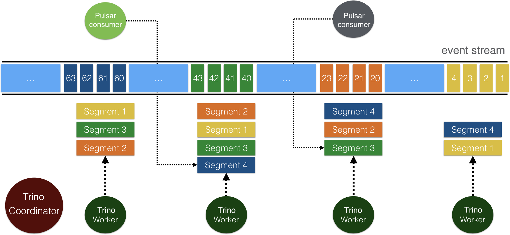

=================
Pulsar connector
=================

.. toctree::
    :maxdepth: 1
    :hidden:

    Tutorial <pulsar-tutorial>

Overview
--------

`Apache Pulsar <https://pulsar.apache.org/docs/en/next/standalone/>`_ is a cloud-native, distributed messaging and streaming platform. 

The Pulsar connector allows you to query data from Pulsar topics as tables in Trino:

* A Pulsar cluster is configured as a catalog in Trino. 
* The Pulsar namespace or tenant combination is mapped to a schema in Trino.
* A Pulsar topic schema is mapped to a Trino table schema.
* A message in a Pulsar topic is presented as a row in Trino.

For how to get started with the Pulsar connector, see the :doc:`pulsar-tutorial`.

Requirements
------------

To connect to Pulsar, you need:

* Pulsar 2.8.0 or higher.
* Network access from the Trino coordinator and workers to the Pulsar web service API. 8080 is the default port.
* Network access from the Trino workers to the Apache ZooKeeper clusters and brokers used by Pulsar. 2181 is the default port.
* Network access from the Trino workers to the Apache BookKeeper clusters and brokers used by Pulsar. 3181 is the default port.

Configuration
-------------

The connector can query simple or multi-node Pulsar deployments with one or multiple ZooKeeper clusters. Create a catalog properties file that specifies the Pulsar connector by setting the ``connector.name`` to ``pulsar`` and configure catalogs with the required and optional properties as desired.

For example, to access a cluster as the ``mypulsar`` catalog, create the file ``etc/catalog/mypulsar.properties``. Replace the connection properties as appropriate for your setup:

.. code-block:: text

    connector.name=pulsar
    pulsar.web-service-url=http://localhost:8080
    pulsar.zookeeper-uri=localhost:2181

Required properties
^^^^^^^^^^^^^^^^^^^

To use the Pulsar connector, you need to configure the following properties.

===================================================== ============================================================================  ==============================================
Property                                              Description                                                                   Default
===================================================== ============================================================================  ==============================================
``pulsar.web-service-url``                            Comma-separated list of URLs of the Pulsar admin web service on the brokers.  http://localhost:8080
``pulsar.zookeeper-uri``                              Comma-separated list of URIs for the ZooKeeper cluster's metadata service.    localhost:2181
===================================================== ============================================================================  ==============================================

You can use the Pulsar connector on a single-node cluster (see the :doc:`pulsar-tutorial`) or multi-node cluster. 

For how to deploy a multi-node Trino cluster, see `Deploying Trino <https://trino.io/docs/current/installation/deployment.html>`_.

For how to deploy a multi-node Pulsar cluster, see `Deploying a Multi-Cluster on Bare Metal <https://pulsar.apache.org/docs/en/next/deploy-bare-metal-multi-cluster/>`_. If there are multiple ZooKeeper clusters and brokers, you need to specify multiple hosts in the configuration file (``etc/catalog/apachepulsar.properties``) as below.

.. code-block:: text

    pulsar.web-service-url=http://host1:8080,host2:8080,host3:8080 

    // If TLS or authentication is enabled, set pulsar.web-service-url=https://host1:8443,host2:8443,host3:8443,host4:8443 

    pulsar.zookeeper-uri=zk1.us-west.example.com:2181,zk2.us-west.example.com:2181,zk3.us-west.example.com:2181

Optional properties
^^^^^^^^^^^^^^^^^^^

The following properties are optional, you can configure them as needed.

General
"""""""

============================================== ===================================================================================================================================================  ==========================================================================
Property                                       Description                                                                                                                                          Default
============================================== ===================================================================================================================================================  ==========================================================================
``pulsar.target-num-splits``                   Number of splits to use for each query.                                                                                                              Choose the greater value between 2 or the number of partitions of a topic.
``pulsar.max-split-message-queue-size``        Size of message buffer for a split.                                                                                                                  10000
``pulsar.max-split-entry-queue-size``          Size of entry buffer for a split.                                                                                                                    1000
``pulsar.max-split-queue-cache-size``          Maximum size of buffered message and entry (in byte).                                                                                                -1 (disabled)
``pulsar.namespace-delimiter-rewrite-enable``  Whether to enable rewriting the Pulsar namespace delimiter. This allows Trino Pulsar tables to be read into other systems like ``Apache SuperSet``.  false
``pulsar.rewrite-namespace-delimiter``         Delimiter used to rewrite Pulsar's default delimiter '/'.                                                                                            “/”
============================================== ===================================================================================================================================================  ==========================================================================

Messaging
"""""""""

===================================== ==========================================================================  ========
Property                              Description                                                                 Default
===================================== ==========================================================================  ========
``pulsar.max-message-size``           Maximum size for an entry in byte.                                          5242880
``pulsar.max-entry-read-batch-size``  Maximum number of entries read in a single read request to BookKeeper.      100
===================================== ==========================================================================  ========

Monitoring 
""""""""""

You can use different ways to monitor the overall health and the status of the Pulsar connector status.

===================================== ======================================================== ========  =======================================================================================================
Property                              Description                                              Default   Example value
===================================== ======================================================== ========  =======================================================================================================
``pulsar.stats-provider``             StatsProvider to collect stats of the Pulsar connector.  Disabled  ``org.apache.bookkeeper.stats.prometheus.PrometheusMetricsProvider`` 
``pulsar.stats-provider-configs``     Configuration for StatsProvider in key-value format.     N/A       ``{"httpServerEnabled":"false", "prometheusStatsHttpPort":"9092", "prometheusStatsHttpEnable":"true"}``
===================================== ======================================================== ========  =======================================================================================================

Offloader 
"""""""""

Pulsar's `tiered storage <https://pulsar.apache.org/docs/en/next/tiered-storage-overview/>`_ feature allows older backlog data to be moved from BookKeeper to long term and cheaper storage, while still allowing clients to access the backlog as if nothing has changed. Tiered storage supports using variou offloaders for long-term storage.

============================================== ===================================================================================  ================
Property                                       Description                                                                          Default
============================================== ===================================================================================  ================
``pulsar.managed-ledger-offload-max-threads``  Maximum number of thread pool size for ledger offloader.                             2
``pulsar.managed-ledger-offload-driver``       Driver used to offload or read old data to or from long-term storage.                N/A (disabled)
``pulsar.offloaders-directory``                Directory used to store offloaders nar file.                                         ./offloaders
``pulsar.offloader-properties``                Properties and configurations related to specific offloader implementation as map.   N/A
``pulsar.nar-extraction-directory``            Directory used to store extraction NAR file.                                         {java.io.tmpdir}
============================================== ===================================================================================  ================

BookKeeper  
""""""""""

`BookKeeper <https://bookkeeper.apache.org/>`_ is a replicated log storage system that Pulsar uses for durable storage of all messages. You can configure different properties to improve performance.

================================================ ==================================================================  ==============================================
Property                                         Description                                                         Default
================================================ ==================================================================  ==============================================
``pulsar.bookkeeper-throttle-value``             Set the threshold for BookKeeper request throttle.                  0 (disable throttling)                                    
``pulsar.bookkeeper-num-io-threads``             Set the number of IO thread.                                        2 * Runtime.getRuntime().availableProcessors()
``pulsar.bookkeeper-num-worker-threads``         Set the number of worker thread.                                    Runtime.getRuntime().availableProcessors()
``pulsar.bookkeeper-use-v2-protocol``            Whether to use BookKeeper V2 wire protocol.                         true
``pulsar.bookkeeper-explicit-interval``          Interval to check the need for sending an explicit LAC.             0 (disabled)
``pulsar.managed-ledger-cache-size-MB``          Size for managed ledger entry cache (in MB).                        128
``pulsar.managed-ledger-num-worker-threads``     Number of threads to be used for managed ledger tasks dispatching.  Runtime.getRuntime().availableProcessors()
``pulsar.managed-ledger-num-scheduler-threads``  Number of threads to be used for managed ledger scheduled tasks.    Runtime.getRuntime().availableProcessors()
================================================ ==================================================================  ==============================================

Type mapping
------------

Trino supports selecting Pulsar types. The following tables show the data type mapping of the Pulsar to Trino.

Avro and JSON schema
^^^^^^^^^^^^^^^^^^^^

======================================= =================================================
Pulsar Avro/JSON schema type            Trino type                                                                
======================================= ================================================= 
``String``                              ``Varchar(unbounded)``
``Enum``                                ``Varchar(unbounded)``
``Fixed``                               ``VarBinary``
``Bytes``                               ``VarBinary``
``Int``                                 ``Integer``
``Int(LogicalType=date)``               ``Date``
``Long``                                ``BigInt``
``Long(LogicalType=time-millis)``       ``TimeType(3)``
``Long(LogicalType=timestamp-millis)``  ``TimestampType(3)``
``Float``                               ``Real``
``Double``                              ``Double``
``Boolean``                             ``Boolean``
``Array``                               ``ArrayType<[Mapped TrinoType]>``
``Map`` (key must be of type string)    ``Map<String, [Mapped TrinoType]>``
``Record``                              ``RowType(All fields mapped to Trino Type)``
``Union``                               Mapped Trino type of first non-null type in Union
======================================= =================================================

Primitive schema
^^^^^^^^^^^^^^^^

============================= ========================
Pulsar primitive schema type  Trino type                                                                
============================= ======================== 
``Boolean``                   ``Boolean``
``Int8``                      ``TinyInt``
``Int16``                     ``SmallInt``
``Int32``                     ``Integer``
``Int64``                     ``BigInt``
``Float``                     ``Real``
``Double``                    ``Double``
``None``                      ``VarBinary``
``Bytes``                     ``VarBinary``
``String``                    ``Varcahr(Unbounded)``
``Date``                      ``Date``
``Time``                      ``Time_Millis``
``TimeStamp``                 ``Timestamp_Millis``
============================= ========================

Protobuf schema
^^^^^^^^^^^^^^^

=========================== ==========================================================
Pulsar protobuf schema type Trino type                                                                
=========================== ==========================================================
``Boolean``                 ``Boolean``
``Byte_String``             ``VarBinary``
``Double``                  ``Double``
``Enum``                    ``Varchar(Unbounded)``
``String``                  ``Varchar(Unbounded)``
``Float``                   ``Real``
``Int``                     ``Integer``
``Long``                    ``Bigint``
``Message``                 * ``Map<[Mapped TrinoType], [Mapped TrinoType]>`` for Map 
                            * ``RowType`` (all fields mapped to Trino Type) for others
=========================== ==========================================================

SQL support
-----------

The connector provides **read-only access** to data and metadata in Pulsar with the statements described in the following sections. 

No other statements are supported.

**Read**

* :doc:`/sql/select`
* :doc:`/sql/show-catalogs`
* :doc:`/sql/show-columns`
* :doc:`/sql/show-schemas`
* :doc:`/sql/show-tables`
* :doc:`/sql/describe`

**Other supported commands**

* :doc:`/sql/explain`
* :doc:`/sql/explain-analyze`
* :doc:`/sql/set-session`
* :doc:`/sql/show-functions`
* :doc:`/sql/show-session`
* :doc:`/sql/use`
* :doc:`/sql/values`

Performance
-----------

The query performance is efficient and highly scalable since Pulsar adopts `two-level segment-based architecture <https://pulsar.apache.org/docs/en/next/concepts-architecture-overview/#apache-bookkeeper>`_. Topics in Pulsar are stored as segments in `Apache BookKeeper <https://bookkeeper.apache.org/>`_. Each topic segment is replicated to some BookKeeper nodes, which enables concurrent reads and high read throughput (you can configure the number of BookKeeper nodes and the default number is 3). In the Pulsar connector, data is read directly from BookKeeper, so Trino workers can read concurrently from horizontally scalable BookKeeper nodes.

Security
--------

You can enable authentication features and secure connections to Pulsar with TLS. 

=========================================== ================================================================================= ==============
Property                                    Description                                                                       Default
=========================================== ================================================================================= ==============
``pulsar.auth-plugin``                      Authentication plugin used to authenticate to Pulsar cluster.                     N/A (disabled)
``pulsar.auth-params``                      Authentication parameter used to authenticate to the Pulsar cluster as a string.  null
                                            For example, "key1:val1,key2:val2".                               
``pulsar.tls-allow-insecure-connection``    Whether the Pulsar client accept an untrusted TLS certificate from broker.        false
``pulsar.tls-hostname-verification-enable`` Whether to allow hostname verification when a client connects to broker over TLS. false
``pulsar.tls-trust-cert-file-path``         Path for the trusted TLS certificate file of Pulsar broker.                       null
=========================================== ================================================================================= ==============